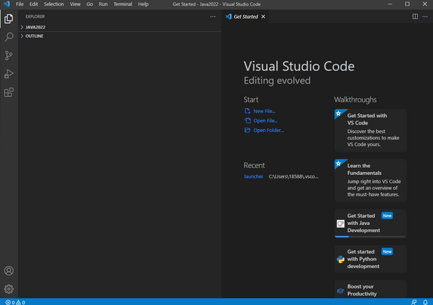
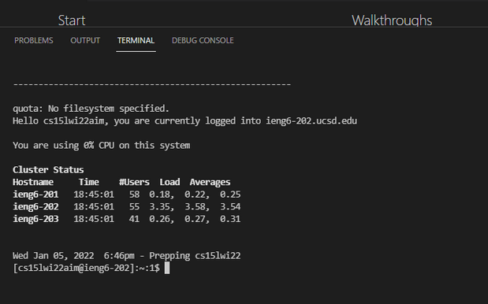
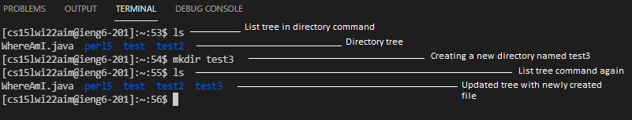
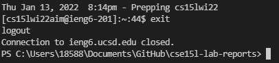
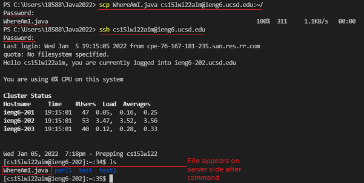
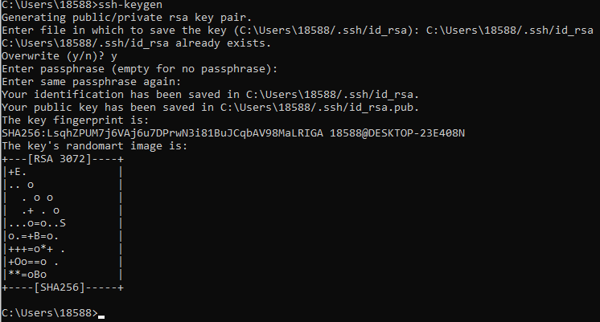
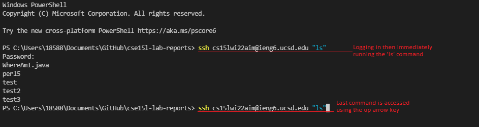

# [VScode]
The first step in logging into a course-specific account on ieng6 is to install VScode.
You can find the website for VScode [here](https://code.visualstudio.com/). Since I am on Windows, I downloaded the Windows version from the dropdown menu. Find the appropriate version for your computer and follow the instructions to complete installation. The home screen of VSCode will look like this:

# [Remotely Connecting]
The next step in order to remotely connect to the server is to download a program called [OpenSSH](https://docs.microsoft.com/en-us/windows-server/administration/openssh/openssh_install_firstuse) which will allow a connection between the client and server. Once the program is installed, you will need to locate your course-specific account in order to access the server later on. You can find your unique information here(https://sdacs.ucsd.edu/~icc/index.php).

Once all this is done, open a terminal in VSCode and enter in the command: `ssh cs15lwi22zz@ieng6.ucsd.edu` making sure to replace “zz” with your course specific letter from the page above. If it is your first time connecting to the server, you will see a message asking if you would like to continue connecting; type yes, hit enter, and provide your password. When typing your password, your keystrokes will not record visually; this is normal. Once you are logged in, your terminal should look like this:

# [Trying some commands] 
Once you are logged into the server, it’s good to try and run some commands and see what happens. Some useful commands include:
* cd ~
* cd
* ls -lat
* mkdir (filename) where file name is the name of the file
* ls -a
* ls <directory> (input a directory in the directory space)

In order to log out of the remote server from the terminal you can either use the shortcut Ctrl-D or the command: `exit`.

# [Moving Files with scp] 
Being connected to the server means that you can transfer files back and forth between the client and the server. I created a file named WhereAmI.java and placed some code in it. 
In order to transfer files use the command scp and type: `scp WhereAmI.java cs15lwi22zz@ieng6.ucsd.edu:~/`
The address at the end will be the same one used to log in. After typing the command, use the same password used to log in. In the terminal, the result should look something like this:

# [Setting an SSH Key]
It is very time consuming having to type or paste long commands while logging in or transferring files back and forth. To combat this, an SSH key can be generated to use in place of a password. 
In order to do this, on my computer command prompt, I typed ssh-keygen. The command window will ask where you want the key files to be generated, as well as a passphrase (can be empty). The result is two created files on my system, the private key in the file id_rsa and the public key in the file id_rsa.pub. 
The command prompt will look like this:

# [Optimizing Remote Running]
An optimal way to run commands on the server is to type them out in one line. At the end of an ssh command, you can write a command in quotes at the end to immediately run the command following the first one.
You can also use the up arrow key on your keyboard to access the last command that was run.

