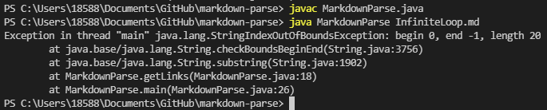
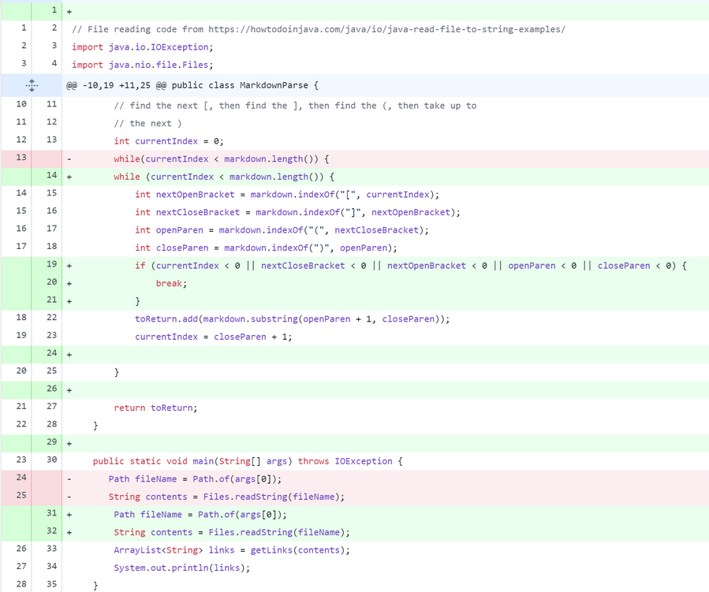
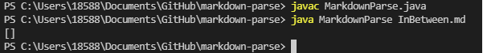
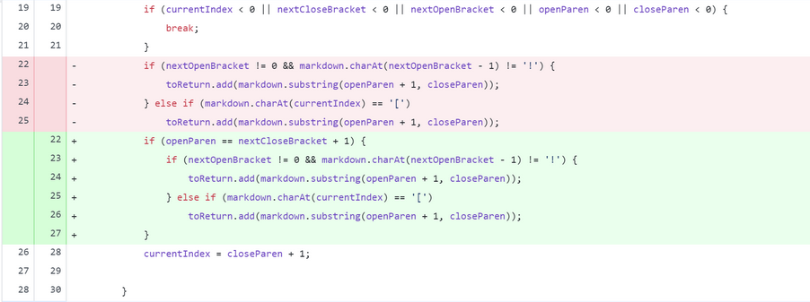
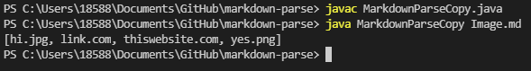
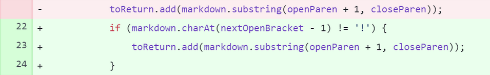

> **Week 2 Lab Report**

# [Code Change 1]

The first bug we tackled was the infinite loop which was caused by having a character after the link. The test file can be seen [here](https://github.com/abdulRibrahim/markdown-parse/commit/dbdcba3b0bf69268c7461f5eac8221788b0c18a3)

The output:

Having a character after the ending parenthesis causes and infinite loop. This is because the code both expects the input to end with an ending parenthesis, or see another link after the first; which should also end with an ending parenthesis.

The fix:

The fix was done by adding lines 19, 20, 21. It allowed a break from the while loop to occur when the proper character was not found in the correct position.

# [Code Change 2]

The next bug we tackled was when the link was not being properly read. Not being properly read indicates that the output would be completely empty. While this output can be cause by many errors, once such instance is when characters are inputted between the link label and the actual link. The test file can be seen [here](https://github.com/abdulRibrahim/markdown-parse/blob/b22e786952857356e9b21862d13d1df5c531198b/InBetween.md)

The output:

The reason why the code doesn't function properly here is because of the index conditions within the while loop of MarkdownParse. The way the while loop traverses the files containing links is by looking at the index of the character "[" , "]", "(", and ")". The code expects that the next character after the ending bracket is an opening parenthesis. When that is not the case, and instead random characters, the code fails and results in and empty link: [].

The fix:

The bug was fixed by adding lines 22-27. These lines of code indicate that the opening parenthesis must be one index great than the closing bracket; meaning no characters should be inbetween the closing bracket and the opening parenthesis.

# [Code Change 3]

The final bug we tackled was having the code make a distinction between images and website links. The test file can be seen [here](https://github.com/abdulRibrahim/markdown-parse/blob/main/Image.md) 

The output:

 Because the syntax of showcasing links and image location is similar, the code displayed them as equivalents. The program depends on the syntax of a link label between brackets followed immediately by an actual link enclosed in parenthesis. It does not know how to differentiate between a link and an image.

 The fix:
 

 The following code was added to a helper method getLinks. This method helped the program differentiate between website links and image links by only returning strings that did not start with an "!" character.

