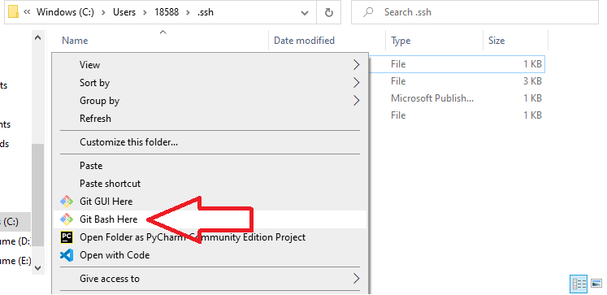
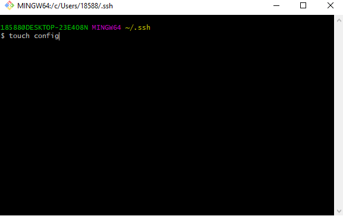
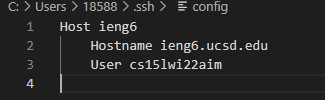
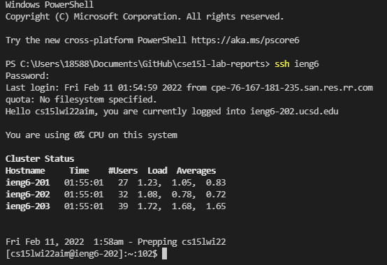
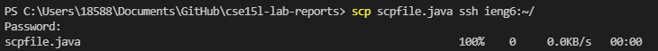

> **Lab Report 3 - Week 6**

# [Streamlining ssh Configuration]

Without `ssh` configuration, the process for logging in, involves typing out the command:

`ssh cs15lwi22zzz@ieng6.ucsd.edu` 
(Replacing zzz with user specific information)

Followed by your password.

That is a lot to remember or type out, especially if you do not have the information saved or available to paste.

There is one way to combat this lengthy process: the configuration of `ssh` using git bash.

Because I did not have a ssh config file created, I need to create a new one under the file path `C:\Users\18588\.ssh`.

Under this path, I right clicked and hit the button "Git Bash Here".

In the window that pops up, I created a file named "config" by typing in the command:
`touch config`

Then, to open the file I typed in the command:
`nano config`
and typed in:
`Host ieng6`
    `HostName ieng6.ucsd.edu`
    `User cs15lwi22zzz (use your username)`.

Opening the file in VSCode, the file looks liks this:

Now we can log into the server with the newly created config file and not have to type out the entire username. We will however, still need to type out our password. The result will look something like this:

We can also combine this shortcut and use scp within the same command line like so:
