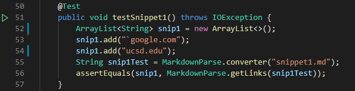
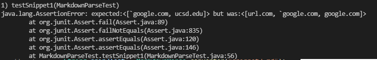
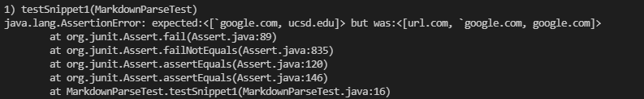
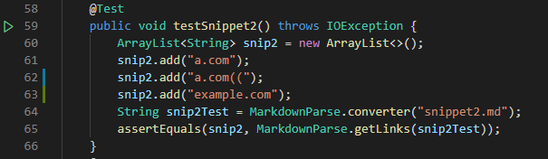
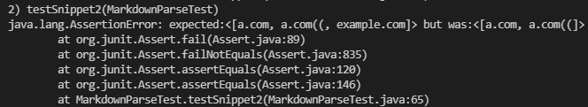
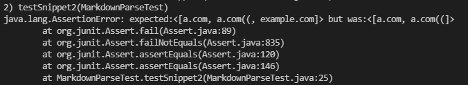
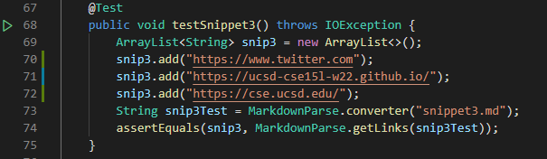
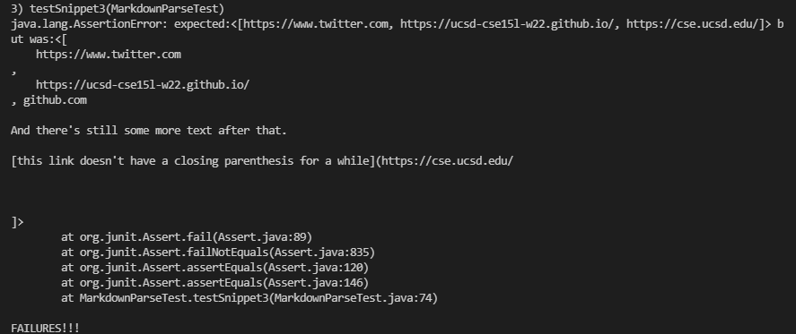
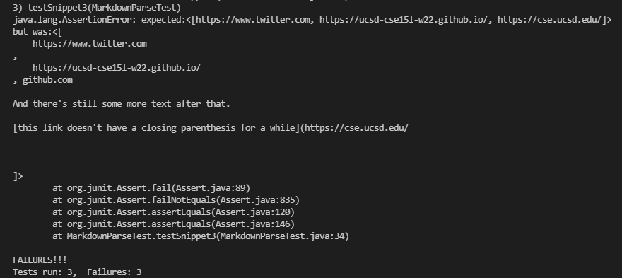

> **Lab Report 4 - Week 8**

# [Link to my markdown-parse repository]
[link](https://github.com/abdulRibrahim/markdown-parse)

# [Link to reviewed repository]
[link](https://github.com/amquach00/CSE15L-TheLunaMoths)

# [Snippet 1]
Using the CommonMark demo site, I concluded that the snippet of code should produce 2 links: `google.com and ucsd.edu.

##### [My repository]  

Code in MarkdownParseTest.java:  
 

Output when running the test:  
  
The test did not pass.

##### [Reviewed repository]
Note: For some reason, the reviewed group repository had never created a testing class nor a make file. I had to create them both in a cloned version of their code.

Output when running the test:  
    
The test did not pass.

# [Snippet 2]
Using the CommonMark demo site, I concluded that the snippet of code should produce 3 links: a.com, a.com((, example.com.

##### [My repository]  

Code in MarkdownParseTest.java:  
 

Output when running the test:  
  
The test did not pass.

##### [Reviewed repository]  
Note: For some reason, the reviewed group repository had never created a testing class nor a make file. I had to create them both in a cloned version of their code.

Output when running the test:  
  
The test did not pass.

# [Snippet 3]
Using the CommonMark demo site, I concluded that the snippet of code should produce 3 links:  https://www.twitter.com, https://ucsd-cse15l-w22.github.io/, and https://cse.ucsd.edu/.

##### [My repository]  

Code in MarkdownParseTest.java:  
 

Output when running the test:  
  
The test did not pass.

##### [Reviewed repository]
Note: For some reason, the reviewed group repository had never created a testing class nor a make file. I had to create them both in a cloned version of their code.

Output when running the test:
  
The test did not pass.

# [Questions]
In regards to Snippet 1, the issue seems to be containing an extra character before the starting open bracket. An easy fix to this may be adding an if conidition to ignore an characters at index 0 and up to the first open bracket if they are not an open bracket. Another problem is having another open bracket appearing after the first before a close bracket. An easy fix for this would be to consider everything inside the first open bracket and the last close bracket to be considered the label, regardless of its character. This should be able to be done in less than 10 lines.

With Snippet 2, the issue seems similar to the issues in snippet 1. The code needs to to be able to consider all characters within the first opening parenthesis and the last closing parenthis to be the label, rather than the introduction to another site. Like the solution in snippet 1, this should be able to be done in less than 10 lines by adding an if condition to ignore opening parenthesis after the first opening parenthis if they are before the last closing parenthesis.

Snippet 3 off the bat seems to be a more involving and challenging tester. This is because the code now needs to look for newline spaces, white spaces, and multiple opening parenthesis in combination with these spaces. I would say the code fix would be over 10 lines of code to solve this issue as there are multiple conditions to face either separately, or a set of combinations.  

