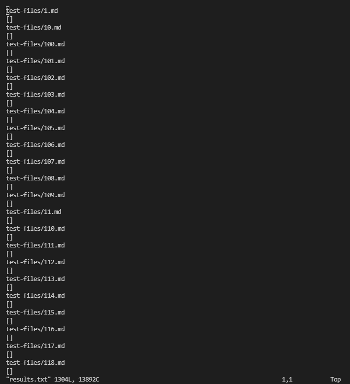
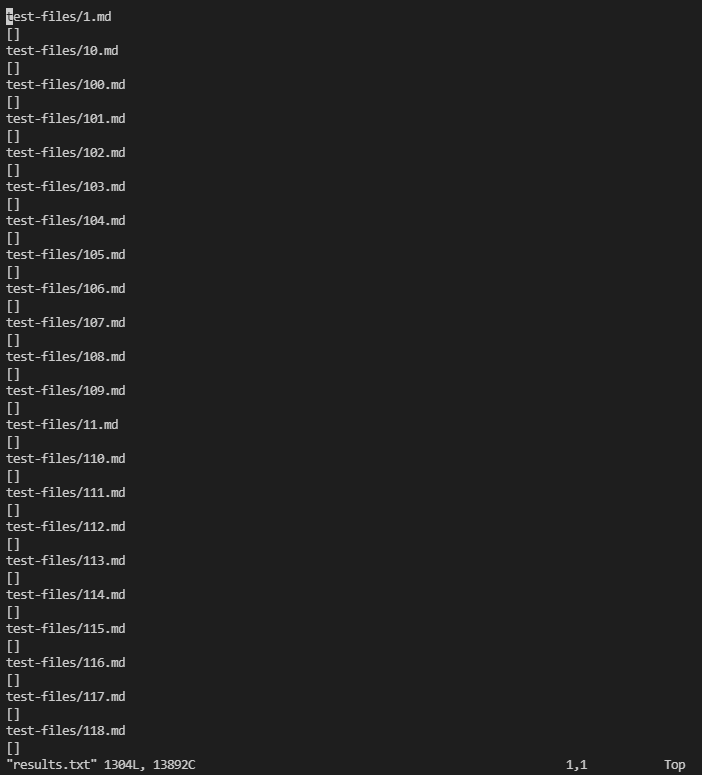

> **Lab Report 5 - Week 10**

# [In our Lab 9]  
The objective of lab 9 was to create a script and run the tests on the new test file containing hundreds of tests. The results of these tests were then saved onto a created text file. These tests were to be run on the groups most recent version of markdown-parse (at the time) and compare the results to the most recent version of the class markdown-parse. The method of comparison was by using the `diff` command. 

# [An interesting find] 
What our group in lab found interesting is that the `diff` command actually produced no output; meaning that there was no difference in output between the groups mark-downparse test results and the updated version of the class markdown-parse test results. 

I wondered if some error had occured while using `diff` so I wanted to view the results directly and compare manually. 

Group test results: 

 

Class markdown-parse test results: 

 

While the images do look exactly the same, it is because the results are the same. The proof is given when using the `diff` command. 
