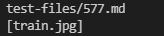
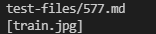
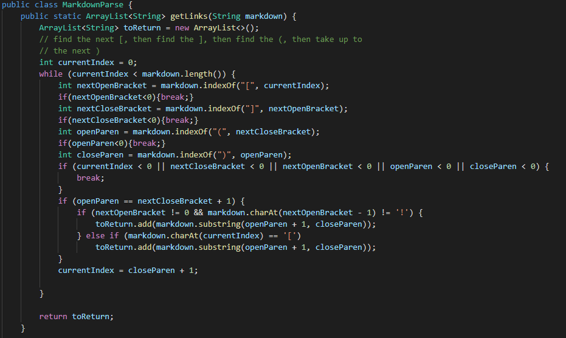
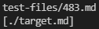
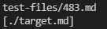

> **Lab Report 5 - Week 10**

# [In our Lab 9]  
The objective of lab 9 was to create a script and run the tests on the new test file containing hundreds of tests. The results of these tests were then saved onto a created text file. These tests were to be run on the groups most recent version of markdown-parse (at the time) and compare the results to the most recent version of the class markdown-parse. The method of comparison was by using the `diff` command. 

# [An interesting find] 
What our group in lab found interesting is that the `diff` command actually produced no output; meaning that there was no difference in output between the groups mark-downparse test results and the updated version of the class markdown-parse test results. 

I wondered if some error had occured while using `diff` so I wanted to view the results directly and compare manually. 

Group test results: 

 

Class markdown-parse test results: 

 

While the images do look exactly the same, it is because the results are the same. The proof is given when using the `diff` command. 

# [What does it mean? | A different approach?] 
While it does mean that the two different codes produced the same output, it does not mean that the output is correct.

Due to the `diff` command not producing any results, its hard to provide a difference in results and addressing different bugs; again, when there is no difference. What I can do however, is manually search through the entirety of the test case results using `cat results.txt` in each respective directory of my groups markdown-parse and the class markdown-parse. 

What I can do with these lists instead, is to look for bugs in which the code should not have produced a link. 

# [Bug 1] 
Looking through my groups results I find one bug:

 

Surely enough, the bug exists also in the class's markdown-parse as well: 

 

In this case, both of our coding implementations would be wrong. In a link parser where the goal is to only read and output links, and image should not be in the output. The expected output should be empty similar to other tests: `[]`.

The aspect of the test that is triggering this error is the `!` character, suggesting that what follows will be an image. As such, a link parser should ignore `!` characters if they come before the first opening bracket character.

The code to fix would be within the while loop the getLinks method: 
 

In this I would add an if condition that if the first character is an `!`, then break out.

# [Bug 2] 
I can use the same manual approach to find bug #2. On test 483, the test is structured as such: ``. The output for both my group and the class markdown-parse files produce: 

 

 

This again is a case where both implementations were incorrect. This is because proper link syntax is to wrap link text in brackets and the actual link in parenthesis. The expected output should be empty similar to other tests: `[]`.

An implementation to correct this bug would be to ignore links that have the ending bracket immediately following the opening bracket; implying that there is no text to wrap the link around. 

Like the previous test, the code to fix would be within the while loop the getLinks method: 
 

Where again I would add an if condition that if the next character after the first open bracket is a close bracket, then I would break.

